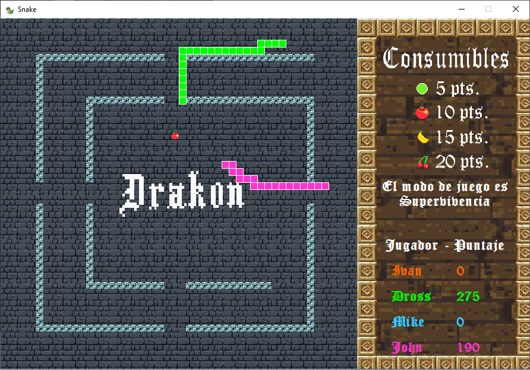

# Snake 
### English: 

Snake game with local, online multiplayer, and artificial intelligence (sort of, A* algorithm).
The game is a mix between the old school snake and games like slither.io where you can eat your opponents bodies.

All written in Java with no use of Game Engines or some sort of Frameworks, except for the Sound Engine made by 
**Niklas Keller (kelunik user)  [Sound Engine](https://github.com/kelunik/SoundEngine) (special thanks to you)**.

### Español: 

Juego de Snake con multijugador local, online e inteligencia artificial utilizando el algoritmo A*.
El juego es una mezcla entre el snake original y el slither.io donde podes comer a tus oponentes.

Todo fue escrito en Java sin usar Motores de Juego o Frameworks excepto por el Motor de Sonido hecho por
**Niklas Keller (usuario kelunik) [Sound Engine](https://github.com/kelunik/SoundEngine)**.

